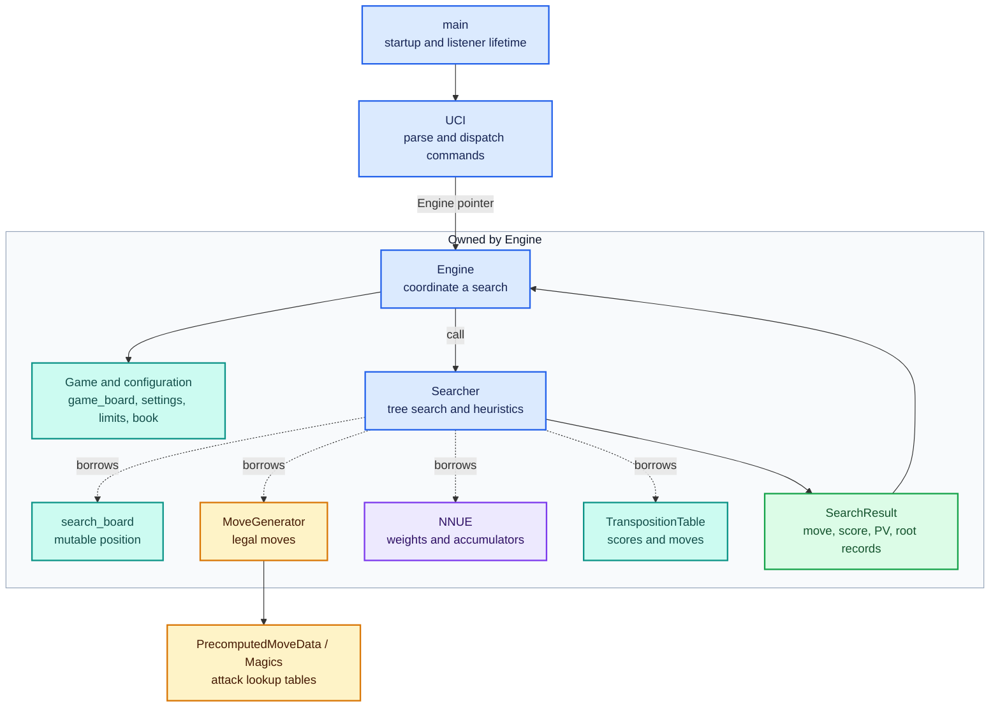
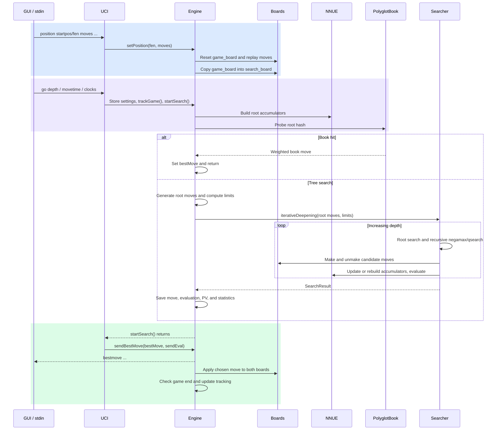
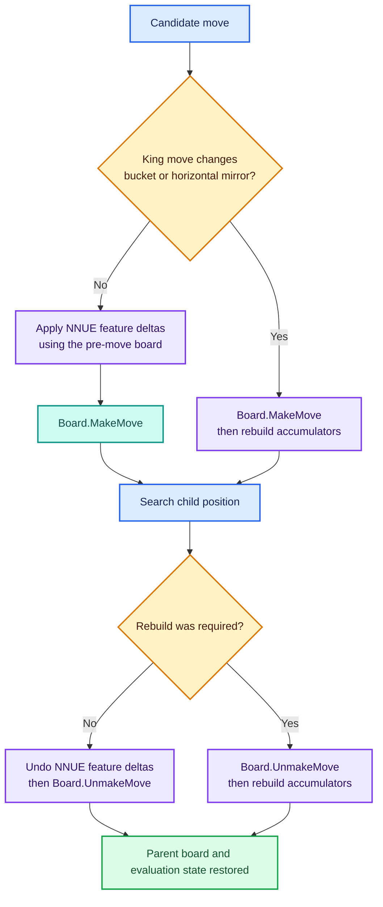

# Engine architecture

[Overview](../README.md) · [Position](position.md) · [Search](search.md) · [NNUE](nnue.md) · [Weights](../nnue/weights/readme.md) · [Validation](validation.md)

`Engine` owns the position and the services used to search it. `UCI` translates text commands into engine operations; `Searcher` borrows the engine's search board, move generator, NNUE evaluator, and transposition table. The searcher returns a `SearchResult`, and the engine publishes and applies the selected move.

The diagrams describe active call paths and runtime ownership. **Blue** identifies control, **teal** mutable state, **purple** evaluation, **amber** supporting services or decisions, and **green** results. Text labels keep the relationships readable without color.

## Ownership and dependencies

The constructor wires `Searcher(search_board, *movegen, nnue, tt)`. Those four arguments are stored as references, not copies. The searcher has no active `Engine&` member and does not print UCI moves. Its own state includes search parameters, killer moves, history scores, and per-move node counts.

`MoveGenerator` refreshes its internal bitboards and masks from the board passed to `generateMoves()`. Its public move buffer is overwritten on each generation call. Search copies moves into a local array before recursion so child generation cannot overwrite a parent's remaining moves.

## Startup

The entry point is [tomahawk.cpp](../src/tomahawk.cpp):

1. Apply the platform-specific CPU-affinity routine, initialize the process instance, and start a session.
2. Initialize logging paths, `PrecomputedMoveData`, and sliding-piece attack tables. Windows calls `Magics::initPEXTMagics()`; other builds call `Magics::initMagics()`.
3. Construct a static `Engine`. Its constructor initializes both boards, the move generator and TT, loads NNUE weights, constructs the searcher, and attempts to load the opening book.
4. Construct `UCI` with a pointer to that engine.
5. Start a listener thread running `UCI::loop()` and join it from `main`.

The listener thread reads stdin line by line. `go` invokes search directly on that thread; there is no separate search-worker dispatch in the current implementation.

Default resource paths originate in [EngineOptions](../include/engine.h) and [Logging](../include/logging.h). CMake embeds `PROJECT_ROOT`, so the executable looks back into the source checkout for its default weights and book. Logging initializes `../san-jacinto/logs/test_logs` relative to that root.

## From position to bestmove

`setPosition()` replays UCI moves in board context so it can assign promotion, castling, en-passant, and double-pawn-push flags. It refreshes check state and copies the completed position into `search_board`.

`startSearch()` probes the book before allocating the search budget. A hit selects a weighted move and translates Polyglot castling coordinates. Otherwise it resets search statistics, generates root moves from `game_board`, computes limits, and calls iterative deepening on the equivalent `search_board`.

After search, `Engine` copies the result's move, evaluation, and PV into its public output fields. `UCI::handleGo()` then calls `sendBestMove()`. This function both prints the move and makes it on `game_board` and `search_board`; a subsequent `position` command rebuilds the supplied game state again.

## Position state and reversible search

| Type | Responsibility |
|---|---|
| [Board](../include/board.h) | Color/piece bitboards, square-to-piece lookup, side to move, check state, Zobrist key, and position history |
| [GameState](../include/gamestate.h) | Reversible metadata such as castling rights, en-passant file, capture information, and fifty-move counter |
| [Move](../include/move.h) | Encoded source, target, special-move flags, and UCI conversion |
| [MoveGenerator](../include/moveGenerator.h) | Legal moves, check/pin restrictions, king safety, and tactical generation |
| [PrecomputedMoveData](../include/PrecomputedMoveData.h) / [Magics](../include/magics.h) | Geometric masks and sliding-piece attack lookup |
| [Zobrist data](../include/zobrist.h) | Hash constants used for position identity and opening-book lookup |

The game board represents the supplied or played game. Search recursively mutates the search board and restores it after each candidate. `Board::MakeMove()` and `UnmakeMove()` maintain board state and history; they do not automatically keep NNUE synchronized. That coordination belongs to the searcher's move helpers.

`update_kings()` chooses whether a rebuild is necessary. A king move inside the same relevant bucket/mirror mapping can use incremental updates. Other moves remove/add feature weights, including capture and special-move changes. Null-move pruning calls `MakeNullMove()`/`UnmakeNullMove()` directly because piece placement does not change.

The NNUE members named `acc_stm` and `acc_ntm` track **White and Black perspectives**, respectively. At evaluation time, the evaluator orders them as **us, them** according to the actual side to move. The [NNUE guide](nnue.md) explains the feature indices and dense layers.

### Contracts between subsystems

The separation between board, generator, and evaluator keeps each representation focused, but it makes synchronization explicit. The following contracts explain what a caller must preserve; they do not imply that every existing path enforces them automatically.

| Boundary | Contract | Consequence for changes |
|---|---|---|
| Engine to searcher | The root move list, search board, and rebuilt NNUE represent the same position | Changing position setup must update the whole root handoff |
| Searcher to board/NNUE | Each completed make/unmake pair restores the parent's semantic board state and both accumulators | Every child exit path, including time cutoffs, must reach restoration |
| Board to generator | Piece representations, side, rights, and en-passant metadata are coherent | A stale field can change legal moves even when a printed board looks correct |
| Generator to recursive caller | The move buffer lasts only until the next generation call | Copy parent moves before descending |
| NNUE to searcher | Evaluation favors the actual side to move; cached perspectives retain White/Black identity | Flipping turns changes input ordering, not the identity of the stored accumulators |
| Searcher to TT | A cached score carries a key, depth, and bound meaning | A lookup cannot treat every returned score as exact or history-independent |

The game/search board split keeps recursive exploration separate from the played position. It adds a synchronization boundary at position setup and when applying the chosen move; it does not provide asynchronous search isolation by itself. The current search still executes synchronously in the UCI listener.

Ownership also determines cache lifetime. NNUE sums follow the current position, generator masks follow the latest generation call, and TT/history heuristics can outlive a single search. “Reset the engine” therefore needs a precise meaning: new position, new search, new game, and new process do not clear identical state.

The [position guide](position.md#reversible-state-and-position-identity) defines board-level invariants, and the [validation guide](validation.md) describes how to check these contracts independently of playing strength.

## Search services and data

| Service or data | Connection to the engine |
|---|---|
| `SearchSettings` | Parsed request: depth, nodes, movetime, clocks, increments, and mode flags |
| [SearchLimits](../include/search_limits.h) | Computed start time, time allowance, depth cap, and stop flag; passed by value into iterative deepening |
| [Searcher](../include/searcher.h) | Runs root search, negamax, qsearch, ordering, pruning, SEE, and synchronized move helpers |
| [NNUE](../nnue/nnue.h) | Owns loaded tensors and two accumulators; supplies scalar or Windows SIMD evaluation |
| [TranspositionTable](../include/tt.h) | Engine-owned cache reused by the searcher; `Hash` resizes it and new-game state clearing empties it |
| [SearchResult / RootMove / PV](../include/search_result.h) | Return move, score, continuation, and root search records to the engine |
| [PolyglotBook](../include/book.h) | Optional early choice before iterative deepening |

The [search guide](search.md) describes the recursive algorithm and exact heuristic gates. Network dimensions are compile-time constants in [network.h](../nnue/network.h); the loader does not automatically choose an architecture from a filename.

## Diagnostics and telemetry

The [UCI command reference](uci.md) lists every dispatched command, search argument, and option, including placeholders and build restrictions. The [build modes and statistics guide](stats.md) explains DEV collection, DEBUG facilities, production behavior, and log interpretation. The table here is a short diagnostic overview.

`uci` reports standard options; `uci_dev` also lists network paths and tuning options. Command parsing is in [UCI.cpp](../src/UCI.cpp), and option/configuration handling is in [engine.cpp](../src/engine.cpp).

| Command | Use |
|---|---|
| `position ...` | Set the position before searches or diagnostics |
| `perft <depth>` | Count legal move-tree leaves |
| `nnue_eval` | Evaluate the current search position with a full accumulator rebuild |
| `nnue_test` | Windows NNUE scalar/SIMD diagnostic |
| `see <square>` | Exercise SEE for captures targeting a square |
| `print_board`, `dumpzobrist` | Inspect board and hash/history state |
| `clear_tt`, `dump_tt` | Clear or inspect TT usage; detailed output depends on the build |
| `dumpstats`, `dumpmoves` | Search/root diagnostics; detailed counters and `dumpmoves` depend on `DEV` |
| `apply_config <name>`, `save_config <name>` | Read/write local INI configuration in `bin/configs/` |

Telemetry is shared through [session.h](../include/session.h), [logging.h](../include/logging.h), [stats.h](../include/stats.h), [timer.h](../include/timer.h), and [game_log.h](../include/game_log.h). Instance/session identifiers and game/search UUIDs associate UCI logs, search records, timings, and game summaries. `DEV` enables detailed search instrumentation and end-of-search JSONL output for analysis in San Jacinto.

`ucinewgame` starts a game session and clears engine state and the TT. The standalone `Searcher` object remains alive, including its killer/history tables. This distinction matters when comparing clean-process tests with successive games in one process.

## Current implementation boundaries

These describe the checked-in behavior rather than all capabilities suggested by option names:

- **Single search worker:** `Threads` is advertised with min/max 1. Search runs synchronously inside the UCI listener, so it cannot consume `stop` or `quit` while searching. `Engine::stopSearch()` also changes the engine's limits, while iterative deepening uses a copy.
- **Partial search controls:** `go nodes` is parsed but `SearchLimits` has no node budget. `go infinite` does not bypass the ordinary clock calculation. `Ponder` is an option, but the UCI `ponderhit` branch is empty. `UCI_ShowWDL` is stored without a WDL-output path in the active `go` handler.
- **Network loading:** the default points to `nnue/weights/`, while `setoption name nnue_weight_file` constructs `bin/nnue_wgts/<value>.bin`. See [loading and compatibility](../nnue/weights/readme.md#loading-and-compatibility).
- **Optional/stub services:** an opening book is attempted if its configured path is nonempty. Syzygy loading, `bench`, and `speedtest` are stubs rather than active implementations.
- **Search details:** qsearch stand pat in check, timeout-result retention, root capture classification, and TT handling have specific limitations documented in [search.md](search.md#limits-results-and-implementation-boundaries).

## Source map

| Area | Entry files |
|---|---|
| Process and protocol | [tomahawk.cpp](../src/tomahawk.cpp), [UCI.cpp](../src/UCI.cpp), [UCI.h](../include/UCI.h) |
| Orchestration and configuration | [engine.cpp](../src/engine.cpp), [engine.h](../include/engine.h) |
| Tree search | [searcher.cpp](../src/searcher.cpp), [searcher.h](../include/searcher.h) |
| Position and moves | [board.cpp](../src/board.cpp), [gamestate.cpp](../src/gamestate.cpp), [move.h](../include/move.h) |
| Move generation and attacks | [moveGenerator.cpp](../src/moveGenerator.cpp), [PrecomputedMoveData.cpp](../src/PrecomputedMoveData.cpp), [magics.cpp](../src/magics.cpp) |
| Neural evaluation | [nnue.cpp](../nnue/nnue.cpp), [network.h](../nnue/network.h), [accumulator.h](../nnue/accumulator.h), [utils.h](../nnue/utils.h), [simd.h](../nnue/simd.h), [simd_defs.h](../nnue/simd_defs.h) |
| Opening book | [book.cpp](../src/book.cpp), [book.h](../include/book.h) |
| Shared constants/utilities | [helpers.h](../include/helpers.h), [helpers.cpp](../src/helpers.cpp), [bits.h](../include/bits.h) |
| Build | [CMakeLists.txt](../CMakeLists.txt) |
