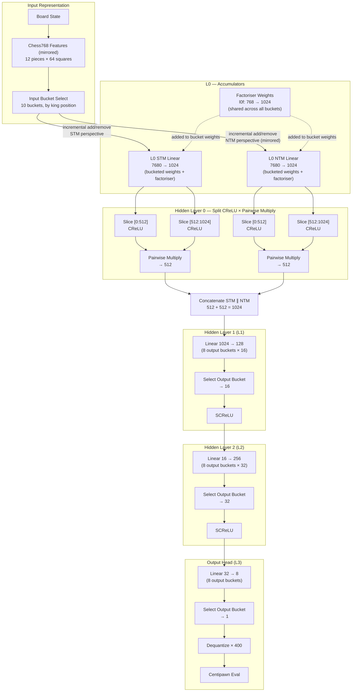
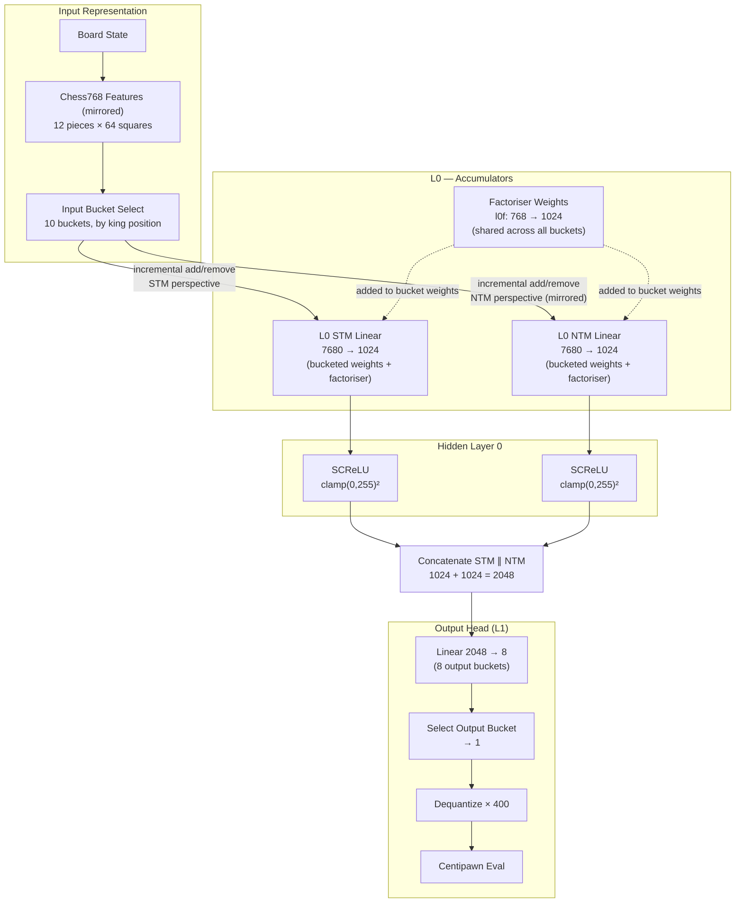

# NNUE Architecture

Two network configurations are trained from the same harness: **v3 ("big net")**, the current/default training file, and **v2 ("small net")**, the earlier single-hidden-layer design. Both share the same input encoding, input bucketing, factoriser, and output bucketing — they differ in what happens between the accumulator and the final score.

---

## v3 — Big Net

Adds two extra hidden layers (L1, L2) between the accumulator and the output, and replaces SCReLU at L0 with a split-CReLU-then-pairwise-multiply activation.

### v3 Layer Reference

| Component | Value |
|---|---|
| Input features | 768 per bucket (7,680 total) |
| Input buckets | 10 (king-position layout) |
| L0 accumulator (STM / NTM) | 1024 / 1024 |
| L0 activation | Split CReLU × pairwise multiply → 512 per side |
| Concatenated vector | 1024 |
| Hidden layer 1 (L1) | 16 per output bucket (128 total, 1 selected) + SCReLU |
| Hidden layer 2 (L2) | 32 per output bucket (256 total, 1 selected) + SCReLU |
| Output buckets | 8 (material count) |
| Output | 1 |
| Weight dtypes | L0 weights/bias: i16 · L1/L2/L3 weights: i8 · L1/L2/L3 bias: i32 |
| QA / QB / QC | 127 / 64 / 64 |
| Bias quant scale | L1 bias: QA×QB · L2 bias: QA×QB×QC · L3 bias: QA×QB×QC² |
| Total parameters | ≈8.79M |
| Weight file size | ≈15.9 MB |
| Output scale | 400 |

---

## v2 — Small Net

Single hidden layer at L0 (SCReLU, no split/multiply), straight to the output head. Same input/output bucketing and factoriser as v3.

### v2 Layer Reference

| Component | Value |
|---|---|
| Input features | 768 per bucket (7,680 total) |
| Input buckets | 10 (king-position layout) |
| L0 accumulator (STM / NTM) | 1024 / 1024 |
| L0 activation | SCReLU, clamp(0,255)² |
| Concatenated vector | 2048 |
| Output buckets | 8 (material count) |
| Output | 1 |
| Weight dtypes | L0 weights/bias: i16 · L1 weight: i8 · L1 bias: i32 |
| QA / QB | 255 / 64 |
| Total parameters | ≈8.67M |
| Weight file size | ≈15.7 MB |
| Output scale | 400 |

---

## Version Comparison

| Aspect | v3 (Big Net) | v2 (Small Net) |
|---|---|---|
| Input buckets | 10 | 10 |
| Output buckets | 8 (material count) | 8 (material count) |
| L0 accumulator size | 1024 per side | 1024 per side |
| L0 activation | Split CReLU × pairwise multiply → 512/side | SCReLU, clamp(0,255)² |
| Concatenated width | 1024 | 2048 |
| Extra hidden layers | L1 (16), L2 (32), each SCReLU, per output bucket | none |
| Final linear | L3: 32 → 8, select 1 | L1: 2048 → 8, select 1 |
| QA / QB / QC | 127 / 64 / 64 | 255 / 64 / — |
| Weight dtypes | L0 i16 · L1–L3 weights i8 · L1–L3 bias i32 | L0 i16 · L1 weight i8 · L1 bias i32 |
| Approx. total parameters | ≈8.79M | ≈8.67M |
| Approx. weight file size | ≈15.9 MB | ≈15.7 MB |
| Output scale | 400 | 400 |

---

## v1 - Base Net

graph LR

subgraph INCR_ACC["Incremental Accumulation (every move)"]

    %% =========================
    %% INPUT
    %% =========================
    subgraph INPUT["Board State Representation"]
        BOARD["Board State"]
        FEAT["Chess768 Features \n12 pieces * 64 squares\nOne-Hot Encoding"]

        BOARD --> FEAT
    end

    %% =========================
    %% ACCUMULATOR (STATE, NOT LAYER)
    %% =========================
    subgraph ACC["Accumulators (Input Layer)"]

        STM["STM State int32[768]"]
        NTM["NTM State int32[768]"]

        L0S["Linear\n768 → 128 L0 STM weights"]
        L0N["Linear\n768 → 128 L0 NTM weights"]

        L0STM["STM Hidden 0 Pre-Activation\n(128)"]
        L0NTM["NTM Hidden 0 Pre-Activation\n(128)"]

    end

    FEAT -->|"incremental add/remove"| STM
    FEAT -->|"flipped-square update"| NTM

    STM --> |"weights added on\nincremental add/remove"| L0S 
    NTM --> |"weights added on\nincremental add/remove"| L0N 

end

    L0S --> L0STM --> A0S
    L0N --> L0NTM --> A0N

subgraph F_PASS["Forward Pass Evaluation (leaf nodes)"]

    %% =========================
    %% HIDDEN LAYER 0 (STM PATH)
    %% =========================
    subgraph H0S["Hidden Layer 0"]

        A0S["SCReLU clamp(0,255)²"]
        A0N["SCReLU clamp(0,255)²"]

        CAT["Concatenate 128 + 128 = 256"]

    end

    A0S --> CAT
    A0N --> CAT

    L1["Linear\n256 → 1"]

    %% =========================
    %% OUTPUT HEAD
    %% =========================
    subgraph OUT["Output Head"]

        SCALE["Dequantize × 400 / (255 × 64)"]
        EVAL["Centipawn Eval"]

    end

end

CAT --> L1 --> SCALE --> EVAL

### v1 Layer Reference

| Component | Value |
|----------|------|
| Input features | 768 |
| STM accumulator | 128 |
| NTM accumulator | 128 |
| Hidden layer (each branch) | 128 |
| Concatenated vector | 256 |
| Output | 1 |
| Weight type | int16 |
| Total parameters | 98.7k |
| Weight file size | ~197 KB |
| SCReLU clamp | 0–255 |
| Output scale | 400 |
| QB | 64 |
| QA | 255 |