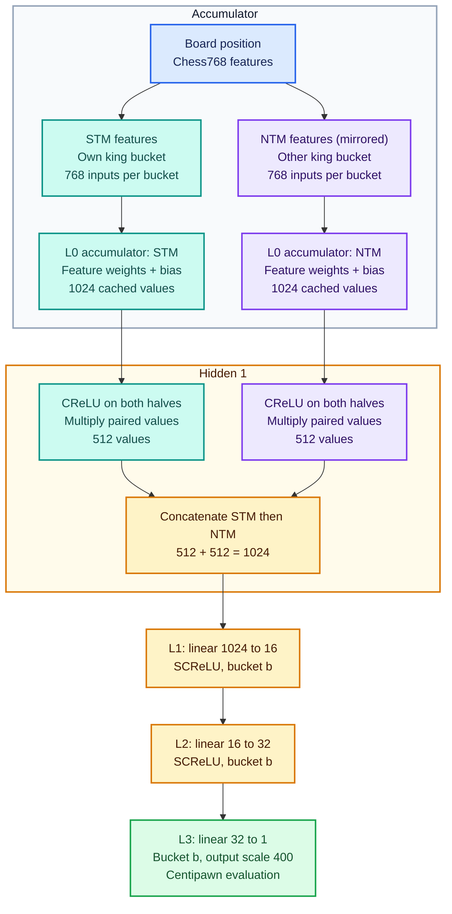
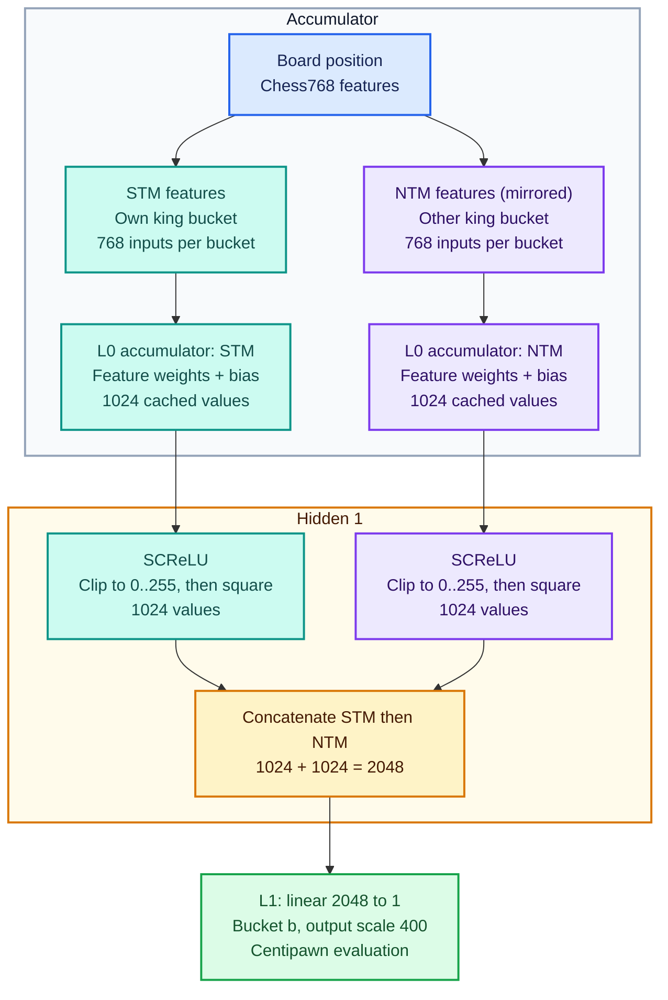
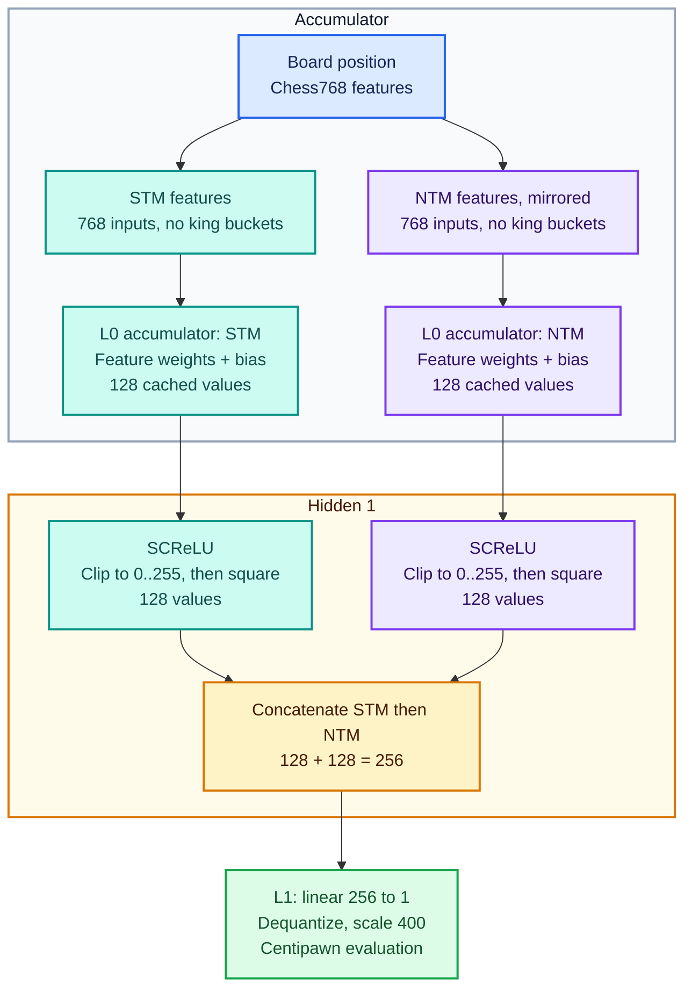

# NNUE Architecture

[Overview](../README.md) · [Engine architecture](engine.md) · [Search](search.md) · [Network weights](../nnue/weights/readme.md) · [Validation](validation.md)

Tomahawk's current evaluator uses **v3 (big net)**. The **v2 (small net)** and **v1 (base net)** sections retain the earlier architecture descriptions for comparison. These are architecture generations, not engine release numbers or rankings of individual weight files.

**Read the diagrams from top to bottom:** blue is the board input; the teal STM and purple NTM columns stay separate until concatenation; amber is the shared forward path; green is the final score. Both columns use the same feature-transformer weights. Dimensions inside each box describe the values on that path.

[Jump to v3](#v3-big-net) · [Jump to v2](#v2-small-net) · [Jump to v1](#v1-base-net) · [Runtime integration](#runtime-integration)

The runtime dimensions and tensor types below are grounded in [network.h](../nnue/network.h), [nnue.h](../nnue/nnue.h), and [nnue.cpp](../nnue/nnue.cpp). Historical training details, including the shared factoriser used for v2/v3, come from the earlier architecture notes; the trainer/exporter is not part of this repository. The runtime loads one L0 weight tensor and does not evaluate a separate factoriser, so training/export preparation is described here rather than drawn as an inference branch.

---

## v3: Big Net

Adds two dense hidden layers (L1, L2) between the accumulator and the output, and replaces SCReLU at L0 with split CReLU followed by pairwise multiplication. The diagram follows one evaluation. Each perspective selects one of 10 input buckets from its king position. The dense layers all use the same output bucket `b = (pieceCount - 2) / 4`, selected from eight stored heads; only the selected dimensions are shown. Each pairwise multiply is element by element within one perspective.

### v3 Layer Reference

| Component | Value |
|---|---|
| Input features | 768 per bucket (7,680 total) |
| Input buckets | 10 (king-position layout) |
| L0 accumulator (STM / NTM) | 1024 / 1024 |
| L0 activation | Split CReLU × pairwise multiply → 512 per side |
| Concatenated vector | 1024 |
| Hidden layer 1 (L1) | 16 per output bucket (128 total, 1 selected) + SCReLU |
| Hidden layer 2 (L2) | 32 per output bucket (256 total, 1 selected) + SCReLU |
| Output buckets | 8 (material count) |
| Output | 1 |
| Weight dtypes | L0 weights/bias: i16 · L1/L2/L3 weights: i8 · L1/L2/L3 bias: i32 |
| QA / QB / QC | 127 / 64 / 64 |
| Bias quant scale | L1 bias: QA×QB · L2 bias: QA×QB×QC · L3 bias: QA×QB×QC² |
| Exported tensor parameters | 8,001,160 (runtime arrays) |
| Training parameter estimate | ≈8.79M including the historical factoriser |
| Weight file size | 15,867,712 bytes (15.87 MB / 15.13 MiB) |
| Output scale | 400 |

---

## v2: Small Net

Single hidden layer at L0 (SCReLU, no split/multiply), straight to the output head. The historical design uses the same 10 input buckets, eight output buckets, and training factoriser as v3. Here `b` is the material-selected output bucket; the diagram shows its single score.

### v2 Layer Reference

| Component | Value |
|---|---|
| Input features | 768 per bucket (7,680 total) |
| Input buckets | 10 (king-position layout) |
| L0 accumulator (STM / NTM) | 1024 / 1024 |
| L0 activation | SCReLU, clamp(0,255)² |
| Concatenated vector | 2048 |
| Output buckets | 8 (material count) |
| Output | 1 |
| Historical export dtypes | Confirm from the v2 exporter; the bundled size differs from the earlier i8-output description |
| QA / QB | 255 / 64 |
| Training parameter estimate | ≈8.67M from earlier notes, including factoriser |
| Bundled weight file size | 15,763,520 bytes (15.76 MB / 15.03 MiB) |
| Output scale | 400 |

---

## Version Comparison

| Aspect | v3 (Big Net) | v2 (Small Net) |
|---|---|---|
| Input buckets | 10 | 10 |
| Output buckets | 8 (material count) | 8 (material count) |
| L0 accumulator size | 1024 per side | 1024 per side |
| L0 activation | Split CReLU × pairwise multiply → 512/side | SCReLU, clamp(0,255)² |
| Concatenated width | 1024 | 2048 |
| Extra hidden layers | L1 (16), L2 (32), each SCReLU, per output bucket | none |
| Final linear | L3: 32 → 8, select 1 | L1: 2048 → 8, select 1 |
| QA / QB / QC | 127 / 64 / 64 | 255 / 64 / — |
| Weight dtypes | L0 i16 · L1–L3 weights i8 · L1–L3 bias i32 | Historical exporter confirmation pending |
| Training parameter estimates (with factoriser) | ≈8.79M | ≈8.67M |
| Bundled weight file size | 15,867,712 bytes | 15,763,520 bytes |
| Output scale | 400 | 400 |

---

## v1: Base Net

This historical network has 768 unbucketed input features and a 128-value accumulator for each perspective. Feature changes add/remove L0 weight vectors directly; a dense 768-value input state is not an extra runtime layer. The current v3 loader does not load this older layout.

### v1 Layer Reference

| Component | Value |
|----------|------|
| Input features | 768 |
| STM accumulator | 128 |
| NTM accumulator | 128 |
| Hidden layer (each branch) | 128 |
| Concatenated vector | 256 |
| Output | 1 |
| Weight type | int16 |
| Total parameters | 98.7k |
| Weight file size | 197,440 bytes (197.44 kB / 192.81 KiB) |
| SCReLU clamp | 0–255 |
| Output scale | 400 |
| QB | 64 |
| QA | 255 |

## Why incremental evaluation fits search

Search visits many positions that differ by one move. In the feature transformer, each active piece contributes a weight vector, so an accumulator is `bias + sum(active feature weights)`. A quiet move usually removes one vector and adds another per perspective. Updating those sums costs work proportional to changed features times accumulator width, rather than all active pieces times that width. The smaller dense layers still run when a position is evaluated.

The cached quantity is the sum **before activation**. Clipping or squaring is nonlinear and loses information: subtracting a removed piece from an already clipped output would not reconstruct the new activation. Keeping the pre-activation sum makes feature addition/removal reversible under the intended integer range.

King buckets make the same piece placement produce different features depending on king location. This gives the feature transformer king context, while horizontal mirroring shares a representation across reflected positions. The cost is a larger input weight table and occasional rebuilds: if a king changes the bucket or mirror mapping, unchanged pieces can acquire different feature indices too. The current search helper rebuilds both perspectives when its boundary test fires. A king move that stays within the mapping can remain incremental.

The two accumulators retain White and Black views using shared weights. Evaluation orders those views according to the side to move, allowing the dense network to distinguish our features from theirs without maintaining a separate weight set for each color. A null move leaves piece features unchanged and changes that ordering.

Material buckets specialize the dense computation by piece count. Only one head per layer is evaluated, so eight stored heads increase parameters without multiplying every evaluation's dense work by eight. V3's within-perspective pairwise multiplication reduces 1024 accumulator values to 512 and introduces multiplicative interactions before the small dense layers. These are consequences of the architecture; whether a particular layout or trained net is stronger requires experimental evidence.

Quantized integers reduce tensor storage and support vectorized arithmetic, but tie inference to the exporter's scaling, clipping, layout, and rounding conventions. Loading the expected number of bytes does not establish that those conventions match. The runtime details below and the [weights guide](../nnue/weights/readme.md#loading-and-compatibility) form the inference/export contract; the trainer is outside this checkout, so unverified training motivations remain historical context rather than runtime facts.

## Runtime integration

### Feature encoding and buckets

Each active piece contributes one of 768 piece/color/square features per perspective. For v2/v3, the perspective king chooses one of 10 input buckets. Files e-h are mirrored onto a-d, and the Black perspective flips ranks and relative piece colors. A bucket selects a feature-weight region; it does not multiply the number of active pieces by ten.

The output bucket is `(pieceCount - 2) / 4`, using integer division and excluding the two kings. There are eight heads. In v3 the selected bucket is shared by L1, L2, and L3; the engine does not compute all 128 L1 or 256 L2 outputs for each evaluation.

### Naming and incremental state

| Diagram name | Runtime representation |
|---|---|
| L0, 1024-wide feature transformer | `l0w`, `l0b`; width constant `L1_SIZE` |
| L1, 16-wide hidden layer | `l1w`, `l1b`; width constant `L2_SIZE` |
| L2, 32-wide hidden layer | `l2w`, `l2b`; width constant `L3_SIZE` |
| L3, output | `l3w`, `l3b`; one score per selected bucket |

The members `acc_stm` and `acc_ntm` actually retain White and Black perspectives during move tracking. `evaluate()`/`eval_simd()` select them as **us, them** for the current side to move. The two perspectives share the loaded feature-transformer weights; the charts show two applications of that transformer, not two independent weight files.

An accumulator caches bias plus the sum of active feature weights before activation. `Searcher::perform_move()` and `perform_unmove()` apply feature deltas around board changes. When a king changes the relevant bucket or mirror mapping, they rebuild the accumulators from the resulting board. See the [state-update flow](engine.md#position-state-and-reversible-search).

### Quantized inference

CReLU clips a value; SCReLU clips and squares it. V3 clamps L0 to `QA = 127`, multiplies matching positions in its first and second 512-value halves, and concatenates the resulting 512 values from each perspective. It never multiplies an STM value by an NTM value.

The dense stages divide accumulated products by `QA`, then `QA * QB`, then `QA * QB * QC` before adding their respective biases. Hidden SCReLU bounds are `QA * QB` and `QA * QB * QC`. After the output bias, the score is multiplied by 400 and divided by `QA * QB * QC * QC`. The diagram's final scaling box summarizes these fixed-point operations.

The active build loads 8,001,160 tensor elements occupying 15,867,712 bytes. Training-only factoriser parameters are not extra runtime tensors. Historical v1/v2 export types and training totals should be confirmed against their original exporters; the [weights profiles](../nnue/weights/readme.md) provide fields for those details.

### Evaluation invariants

At every evaluation boundary, both cached perspectives must equal bias plus the full feature sum for the current board and king mappings. Applying a move and undoing it must restore both vectors, not merely produce the same final score. Captures, promotions, castling, and en passant alter different feature sets; changing output buckets must select the same bucket across all v3 dense layers.

Scalar and SIMD paths must interpret the same tensors and perform equivalent fixed-point operations, including clipping, division, and intermediate ranges. Accumulator or product overflow cannot be treated as an acceptable approximation. Compare intermediate layers when changing quantization or vector code; final-score agreement alone can conceal internal differences erased by later activation or rounding. The [validation guide](validation.md#nnue-agreement) distinguishes the available diagnostics from checks that are not automatically exercised.
