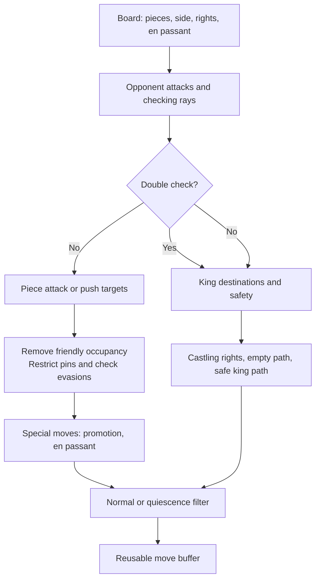

# Position representation and move generation

[Overview](../README.md) · [Engine architecture](engine.md) · [Search](search.md) · [Validation](validation.md)

A position is more than piece placement. Legal moves also depend on the side to move, castling rights, and en-passant availability; draw detection additionally depends on counters and history. Tomahawk keeps these in `Board` and `GameState`, while `MoveGenerator` derives attacks, checks, pins, and legal moves from a supplied board.

## Representation

The conventions are defined in [helpers.h](../include/helpers.h), [board.h](../include/board.h), [gamestate.h](../include/gamestate.h), and [move.h](../include/move.h).

| Representation | Convention | Purpose |
|---|---|---|
| Square | `a1 = 0`, `h1 = 7`, `a8 = 56`, `h8 = 63`; index = `rank * 8 + file`, both zero-based | A square index also identifies a bit in a `U64` |
| Color | White = 0, Black = 1 | Indexes color occupancy; `is_white_move` is a boolean with a different meaning |
| Piece type | Pawn, knight, bishop, rook, queen, king = 0 through 5 | Indexes six type bitboards containing both colors |
| Colored piece | `type + 6 * color`; empty square = -1 | `sqToPiece[64]` gives direct square lookup |
| Occupancy | `colorBitboards[0] \| colorBitboards[1]` | Blockers for sliding attacks and occupied-square tests |
| Piece set | `pieceBitboards[type] & colorBitboards[color]` | All pieces of one type and color |
| Move | 16 bits: source in bits 0–5, target in 6–11, flag in 12–15 | Compact move lists and TT entries |
| Castling rights | Bits 0–3 represent White kingside, White queenside, Black kingside, Black queenside | Records permissions that piece placement cannot recover |
| En passant | File 0–7, or -1 when absent | The side to move determines the capture rank |

Bitboards make set operations cheap: a knight's attack mask intersected with enemy occupancy gives capture targets. Square lookup makes questions such as “which piece moves from here?” cheap. Keeping both representations avoids repeatedly converting between these views, but every mutation must keep them consistent. Internal colored-piece indices should not be confused with the interleaved Polyglot piece ordering mentioned in hashing comments.

A `Move` stores neither the captured piece nor the previous castling rights. Its flags distinguish ordinary moves, en passant, castling, double pawn pushes, and four promotion types. The board supplies context, and `GameState` history supplies information needed to undo a move. `Engine::setPosition()` resolves UCI move strings in board context; coordinates alone do not identify every special move.

## Deriving legal moves

[MoveGenerator::generateMoves()](../src/moveGenerator.cpp) refreshes its cached occupancy and metadata on every call. It builds opponent attacks first, then uses that information to restrict moves for the side to move.

An attack map is not an opponent legal-move list. Pawn attacks differ from pawn pushes, and attacked squares matter for king safety even when the attacking piece cannot legally move there without exposing its own king.

For a single check, non-king moves must capture the checker or block the checking ray. A pawn or knight check cannot be blocked, so its checker square is the relevant target. Under double check, the generator only considers king moves. A pinned piece is restricted to its alignment with its king; a pinned knight consequently has no legal destinations.

King moves exclude friendly occupancy and opponent attacks. Extended checking lines prevent the king from retreating along a slider's ray into a square that its old position had shielded. Castling also checks rights and empty paths, and excludes attacked king transit/destination squares. The extra queenside empty square is checked separately because the king does not cross it.

The generator owns one reusable `moves` array. Recursive callers must copy its returned moves before generating children. Both search and `Engine::perft()` do this. Treating the array as a persistent view of a parent position lets child generation overwrite moves still waiting to be searched.

## Sliding attack lookup

Rook and bishop attacks depend on both their square and the blockers along their lines. Tomahawk precomputes the possible attack sets, then turns the relevant occupancy bits into a table index. A queen combines rook and bishop attacks.

[magics.h](../include/magics.h) selects two implementations: Windows uses BMI2 `PEXT` to extract masked occupancy bits into a compact index; other builds use magic multiplication and shifts. [magics.cpp](../src/magics.cpp) initializes the tables. Both interfaces accept a square and occupancy and return attacks through empty squares up to and including the first blocker in each direction. The caller removes friendly-occupied destinations.

This exchanges table memory and initialization work for inexpensive repeated lookups during search. The table answers an attack-geometry question; pins, check evasions, and other legality constraints remain the generator's responsibility.

## Reversible state and position identity

[Board::MakeMove() and UnmakeMove()](../src/board.cpp) mutate piece placement, side to move, castling rights, en-passant state, the fifty-move counter, hashes, and histories. Undo reverses piece changes and restores prior metadata from `gameStateHistory`. Search mutates one board down a branch instead of copying the entire position at every node, so restoration is part of the recursive algorithm's correctness.

The intended invariants are:

| Invariant | Why it matters |
|---|---|
| Color occupancies are disjoint; type occupancies and square lookup describe exactly the same pieces | Different subsystems must see the same position |
| `move_color` agrees with `is_white_move`, and check state describes that side | Generation, evaluation sign, and pruning depend on it |
| Incremental `zobrist_hash` equals `computeZobristHash()` | TT lookup and repetition tracking must use the actual board state |
| A real move followed by its undo restores semantic position state and history counts | Siblings must start from the same parent |
| Board and NNUE describe the same position before evaluation | Board mutation alone does not update accumulators |

These are contracts to verify, not claims that every code path is already tested. Compare meaningful fields rather than raw object bytes; containers, padding, and cached text are not a position identity. `fen` is generated text, so use `getBoardFEN()` when a refreshed serialization is needed. Copy construction also deserves a field-by-field check: the explicit copy constructor does not copy every member, including `plyCount` and `is_in_check`.

Zobrist hashing XORs keys for pieces, side to move, castling rights, and en-passant file. XOR permits updating only changed components and undoing them with the same operation. The active full and incremental paths include any recorded en-passant file, even when no capture is available. This can distinguish positions with the same legal possibilities; hash consistency and chess repetition equivalence are separate questions.

The key does not encode the fifty-move counter or the repetition path. A matching key therefore cannot by itself prove that a cached draw result applies in another history. See [TT behavior](search.md#transposition-table).

Null moves are search-only passes. They flip the side and hash, clear en passant, and push reversible metadata without moving pieces or adding a real-position repetition entry. Undo restores the parent. Their check-state handling assumes the caller was not in check, as required by the null-move pruning gate.

## One move across the subsystems: en passant

Consider White playing `e5d6` en passant after Black's `d7d5`, with kings placed so the capture is legal. The destination `d6` is empty; the captured pawn is on `d5`.

| Subsystem | Required change |
|---|---|
| Legality | Evaluate king safety with `e5` and `d5` cleared and `d6` occupied; removing both pawns can expose a rook line |
| Board | Move the White pawn from `e5` to `d6`, remove the Black pawn from `d5`, clear en passant, reset the fifty-move counter, change side |
| Hash | Remove/add the corresponding piece keys, remove the old en-passant key, and toggle the side key |
| NNUE | Remove the two old piece features and add the White pawn on `d6`, for both perspectives |
| Undo | Restore both pawns, prior metadata, histories, hash, and accumulator values |

This is why “capture means occupied destination” is insufficient. The current generator has a dedicated en-passant safety path, but `shouldAddMove()` only admits occupied-destination captures and promotions outside check in quiescence. It therefore filters out en passant there. Its en-passant check-evasion gate also tests the captured pawn against the checking ray; blocking a slider check on the destination warrants separate coverage.

Another current boundary is `hasLegalMoves()`: its ordinary branch calls `generateSlidingMoves(false)` instead of generating friendly slider moves, and its double-check branch does not return the resulting king-move count. It should not be treated as an independently verified substitute for a full legal-move count. These are implementation issues, not properties of the architecture. See [validation](validation.md) for checks that expose such differences.
