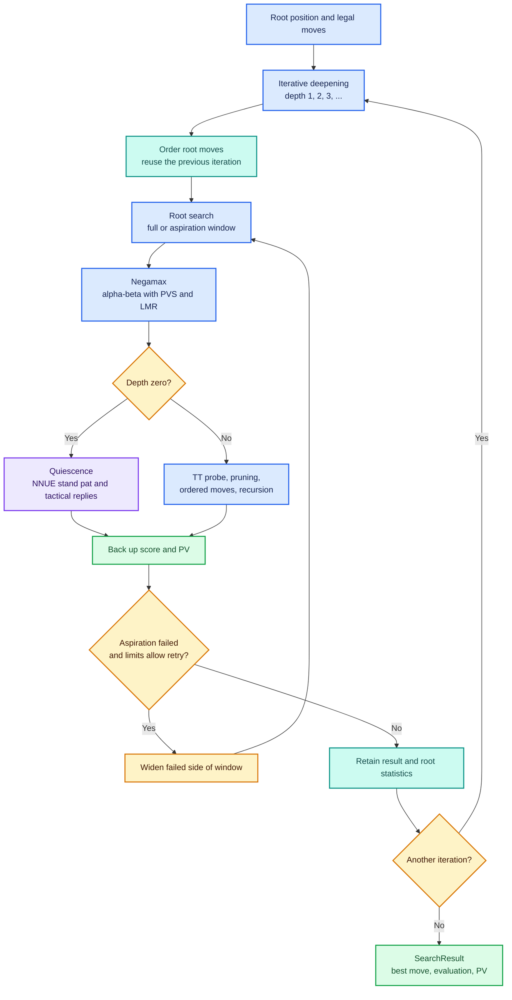
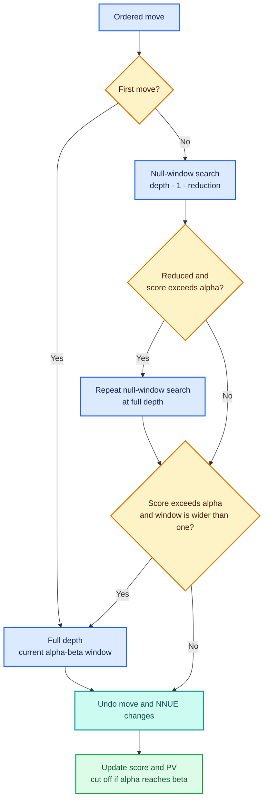

# Search

[Overview](../README.md) · [Engine architecture](engine.md) · [Position](position.md) · [NNUE](nnue.md) · [Validation](validation.md)

Tomahawk searches legal moves with iterative deepening and alpha-beta negamax. Quiescence extends leaf searches through tactical continuations. Pruning, reductions, cached results, and move ordering control how much of the tree is visited. The implementation is in [searcher.cpp](../src/searcher.cpp), with parameters and interfaces in [searcher.h](../include/searcher.h).

Diagrams use **blue for search control**, **purple for evaluation**, **amber for decisions**, **teal for reusable state**, and **green for results**. Labels carry the same meaning without color.

## From a position to a move

`Engine::startSearch()` builds root NNUE accumulators and probes the opening book. A book hit bypasses tree search. Otherwise, the engine generates root moves, computes `SearchLimits`, and calls `Searcher::iterativeDeepening()`.



### Search vocabulary

| Term | Meaning here |
|---|---|
| Depth | Remaining nominal search depth in plies (half-moves) |
| Ply | Distance from the root; indexes the PV and killers and adjusts mate scores |
| Alpha | Best lower bound found for the side to move |
| Beta | Cutoff threshold: reaching it makes further siblings unnecessary |
| Full / null window | An interval wider than one score unit / a one-unit test of a bound |
| PV | Principal variation: the best continuation collected while backing up scores |
| Static evaluation | NNUE's score before searching replies, from the side-to-move perspective |
| Fail low / fail high | A result at or below alpha / at or above beta |

Negamax uses one routine for both colors. After a move, the child window is `[-beta, -alpha]` and the parent score is the negative of the child's score. Positive values favor the side to move at that node.

## Why the search is organized this way

Alpha-beta asks whether a continuation can still affect the choice at its parent. Once a move reaches beta, the parent already has an alternative that makes the remaining siblings irrelevant. With the same leaves and no selective heuristics, this preserves the minimax result while avoiding work. Good move ordering exposes those cutoffs earlier; its value is the subtrees it prevents, not just the quality of the first move's static score.

Iterative deepening repeats shallow work to obtain a previous best move, a PV, cached TT information, and a score estimate for the next iteration. Those improve ordering and support aspiration windows, which seek the next score inside a narrow interval around the last one. An unexpected score requires widening and retrying. The repeated work buys better information and intermediate results; the current timeout behavior below still needs to be distinguished from a guarantee of returning only completed iterations.

PVS uses the ordering assumption directly: after searching the first move, later moves initially need only answer “can this beat alpha?” A null-window result answers that bound question cheaply but does not generally establish an exact score. A promising result may need a wider search. LMR adds another assumption—that late moves are less likely to matter—and initially searches them less deeply. Re-searching improvements at full depth checks the promising cases, but cannot recover a strong move whose reduced search incorrectly failed low.

Pruning and reductions therefore introduce selective risk beyond ordinary alpha-beta. Null-move pruning relies on the position remaining good even after passing; zugzwang challenges that assumption. Futility margins rely on static evaluation being informative at shallow depth; tactics can invalidate that estimate. Their gates and thresholds are testable policy, and should not be read as mathematical guarantees. The tables below describe current implementation choices, not established historical reasons for choosing each constant.

Quiescence addresses a different problem: stopping immediately after a capture can score material that the opponent can recapture. Searching tactical replies gives evaluation a more stable frontier. Stand pat acts as a lower-bound candidate under the assumption that the side can avoid worsening its position; it is not a legal pass and is invalid as a substitute for answering check. Current check handling is documented below.

## Iterative deepening and root search

`iterativeDeepening()` rebuilds the root accumulators, clears its per-move node-count table, and starts at depth 1. The first iteration uses ordinary tree move ordering. Later iterations put the previous best move first, then sort remaining `RootMove` records by their `exact` flag, evaluation when both are exact, and node count as a final tiebreaker. Unresolved bounds use search effort as an ordering hint.

`search()` searches root moves with PVS and records their scores, PVs, node counts, and whether they received a full-window search. From depth 6, it starts with an aspiration interval around the previous evaluation:

```text
delta = max(ASPIRATION_WINDOW,
            ASPIRATION_WINDOW + depth * ASPIRATION_DEPTH_SCALE)
alpha = previousEval - delta
beta  = previousEval + delta
```

Defaults are a 50-centipawn base and 10 centipawns per depth. A fail low widens the lower edge; a fail high widens the upper edge. Each retry multiplies the next widening amount by `ASPIRATION_RESEARCH_SCALE` (2.0).

The outer loop stops for time/depth limits, a near-mate score (`abs(eval) >= MATE_SCORE - 10`), or after depth 2 when only one legal root move exists. It retains a result whenever its best move is non-null. This does not strictly guarantee a completed iteration: a timed-out root pass can still provide a non-null move.

## Negamax at an interior node

The active order in `negamax()` is:

1. Compute NNUE evaluation, count the node, and check time.
2. Return `DRAW_EVAL` for threefold repetition or a fifty-move counter of at least 100 half-moves.
3. At depth zero, call `quiescence()`.
4. Probe the transposition table for a usable score and an ordering hint.
5. Try reverse futility pruning and null move pruning.
6. Generate and sort legal moves. No moves returns `-MATE_SCORE + ply` in check or zero for stalemate.
7. Apply late quiet-move futility pruning, choose an LMR reduction, make each remaining move, and search with PVS.
8. Undo the move, update score/PV and alpha, and stop on a beta cutoff. Update killers/history at cutoffs.
9. Store an exact value, upper bound, or lower bound in the TT.

### PVS and late move reductions

PVS searches the first move at full depth with the current window. Later moves receive a null-window test around alpha, potentially at reduced depth.



Interior LMR applies to moves classified as non-captures and non-promotions when the parent is not in check. The code does not separately exempt moves that give check. `R_lmr(depth, i)` returns zero for `i <= 3` or `depth <= 3` by default; `i` is zero-based, so the first four moves are unreduced. Otherwise:

```text
reduction = min(int(0.99 + log(depth) * log(i) / 3.14), depth - 2)
```

A reduced result above alpha is checked at full depth with a null window. If it still beats alpha and the parent window is wider than one, PVS repeats with the full window. Root search uses the same re-search pattern, though its capture test occurs after making the move.

## Pruning reference

Pruning skips a move or returns from a node. LMR searches less deeply and verifies promising results.

| Technique | Active conditions and action | Defaults |
|---|---|---|
| TT cutoff | Matching key, sufficient depth; exact score, upper bound at/below alpha, or lower bound at/above beta | See [TT behavior](#transposition-table) |
| Reverse futility | Depth below 3, null window, not in check, beta below `MATE_SCORE - 100`; return `static_eval - depth * margin` if it reaches beta | Margin 150 cp per depth |
| Null move | `depth - R_NMP > 0`, `can_nmp`, not in check or a pawn endgame, static evaluation above beta; pass and search at `depth - R_NMP` around beta | `R_NMP = 3` |
| Late quiet futility | Depth at most 3, not in check, `abs(alpha) < 9000`, `static_eval + depth * margin <= alpha`; skip late moves that are not captures, promotions, or checks | Margin 100 cp; indices `i > 5` |
| Quiescence SEE | Destination-square capture, not a promotion, parent not in check; skip if SEE is below threshold | -50 cp |
| Quiescence delta | Same eligibility as SEE; skip if `standPat + DELTA_PRUNE_THRESHOLD < alpha` | Fixed 1,000 cp margin |

The null-move child receives `can_nmp = false` to prevent consecutive passes. Piece placement and NNUE sums stay unchanged; board state handles the pass, and evaluation selects the new side-to-move ordering. There is no separate null-move verification search.

The futility gate contains `!(alpha - beta > 1)`, which does not restrict ordinary `alpha < beta` searches to null windows. Delta pruning uses a fixed margin rather than adding the captured piece's value.

## Quiescence search

Quiescence avoids evaluating a position just before a tactical reply such as a recapture. It recursively explores tactical moves without a separate qsearch depth budget.

`quiescence()` checks time and draws, then computes an NNUE **stand-pat** score. A score at or above beta returns immediately; otherwise it can raise alpha. The routine calls `MoveGenerator::generateMoves(board, true)`, applies SEE/delta pruning, and searches the remaining moves with `[-beta, -alpha]`. It uses the same board/accumulator make-and-unmake helpers as negamax.

The generator admits promotions and occupied-destination captures outside check, and legal evasions in check. En passant has a separate generation path, but its empty destination causes the final quiescence filter to discard it outside check. Quiescence traverses generated order directly; it does not call `orderedMoves()`. Its TT probe/store blocks are commented out.

**Current check-handling detail:** stand pat is applied before generation without a `!board.is_in_check` guard. Although the generator can provide all evasions, the routine can return before reaching them. If generation produces no moves, it returns mate in check or stand pat otherwise. This differs from the usual check-aware stand-pat rule.

## Move ordering and SEE

`orderedMoves()` scores the entire list and sorts descending:

| Priority | Score or rule |
|---|---|
| TT move | 10,000,000 |
| Previous PV move at this ply | 9,000,000 |
| Non-capturing promotion | 8,500,000 plus promotion bonus |
| Non-losing capture | 8,000,000 plus SEE; capturing promotions also add promotion bonus |
| First / second killer | 7,000,000 / 6,999,999 |
| Quiet move | `historyHeuristic[sidePiece][target] / 16` |
| Losing capture | -1,000,000 plus SEE and any promotion bonus |

Promotion bonuses are queen 900, knight 300, rook 100, bishop 100. Capturing promotions use capture scoring. Capture classification here checks destination occupancy, which treats en passant differently from ordinary captures.

At a beta cutoff, qualifying non-promotion moves to squares unoccupied by the enemy become killers for that ply. The cutoff move also receives a `depth * depth` history bonus indexed by colored piece and target. These tables belong to `Searcher`; iterative deepening does not clear or age them on each search.

`SEE()` estimates exchanges on an occupied target square with piece values and a least-valuable-attacker sequence, then backs up the gains to allow either side to stop exchanging. The current implementation tracks used attackers but queries sliding attacks against the original occupancy. It returns zero for an empty destination (including en passant) and does not model promotion gains internally; promotion ordering adds a separate bonus. SEE informs capture ordering and qsearch pruning; the alternative MVV-LVA scoring is commented out.

`rootMoveScore()` exists as a helper, but the active iterative-deepening loop uses the `RootMove` sorting described above.

## Transposition table

[tt.h](../include/tt.h) implements a direct-mapped table indexed by `zobrist_hash & (entriesCount - 1)`. Each entry holds the full key, a 16-bit evaluation and depth, age, bound type, and encoded best move. Callers verify the key before trusting it. A collision replaces the old entry; the same position is replaced when the new depth is at least as deep.

An insufficient-depth hit can still supply the first move to try. On storage, `bestEval <= alphaOrig` produces an upper bound, `bestEval >= beta` a lower bound, and other results an exact entry. Quiescence does not cache results.

Draw handling is history-sensitive. Negamax marks repetition/fifty-move returns with `tainted`, but the guard suppressing TT storage for tainted ancestors is commented out. Mate scores are stored directly; `store()` does not use its `ply` argument to normalize mate distance.

### What a cached bound promises

For a search entered with window `[alphaOrig, beta]`, the entry records what that search established:

| Entry | Meaning at its stored depth | When the bound can end a later search |
|---|---|---|
| Exact | Value found inside the original window under the search's policy | A matching key and sufficient depth permit reuse |
| Lower bound | Value is at least the stored score | Stored score reaches the new beta |
| Upper bound | Value is at most the stored score | Stored score is at or below the new alpha |

For example, a lower bound of +80 cp proves a cutoff against beta = +50, but does not settle a search with beta = +120. The stored move can still help ordering even when the score cannot cut off. “Exact” is a search result at a depth under selective rules, not a solved chess position.

The validity requirements extend beyond matching a table index: verify the key, depth, bound direction, and score representation. Mate distance is root-ply dependent unless normalized for storage; repetition and fifty-move outcomes depend on state absent from the key. The current limitations above are important precisely because a TT reuses results across different paths. See [search validation](validation.md#search-correctness-and-performance).

## Limits, results, and implementation boundaries

[SearchLimits](../include/search_limits.h) checks elapsed time, a local `stopped` flag, and maximum depth. `Engine::computeSearchTime()` uses a requested movetime/depth or approximately `timeLeft / movesToGo + increment / 2 - overhead`, with 20 moves to go by default and a 10 ms minimum for clock-based searches. A nonpositive time limit disables elapsed-time cutoff.

[SearchResult](../include/search_result.h) returns the best move, evaluation, PV, and root records. The engine receives it and publishes the move through UCI. See [the engine lifecycle](engine.md#from-position-to-bestmove).

- Search runs synchronously in the UCI listener. `stop` cannot be handled during the call, and iterative deepening receives `SearchLimits` by value. Node limits and true infinite/ponder control are not enforced by this limit object.
- Root capture classification occurs after `perform_move()`, while interior classification occurs before it. The root LMR gate does not see the same destination occupancy.
- Internal iterative deepening is commented out. Qsearch ordering/TT use, repetition-based TT suppression, and mate-score normalization should not be assumed from nearby comments or declarations.
- `DEV` builds instrument nodes, pruning, cutoffs, re-searches, and timing through [stats.h](../include/stats.h) and [timer.h](../include/timer.h). Other builds still increment aggregate node counts.
